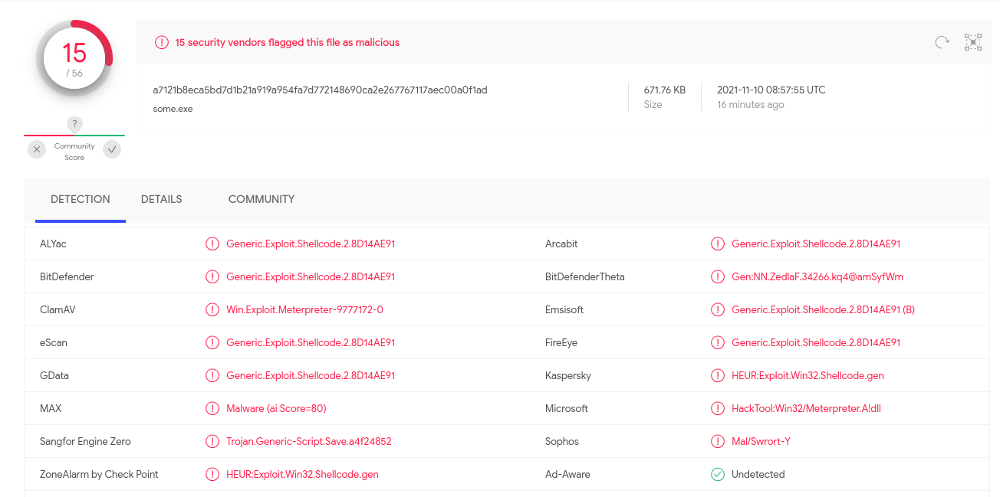
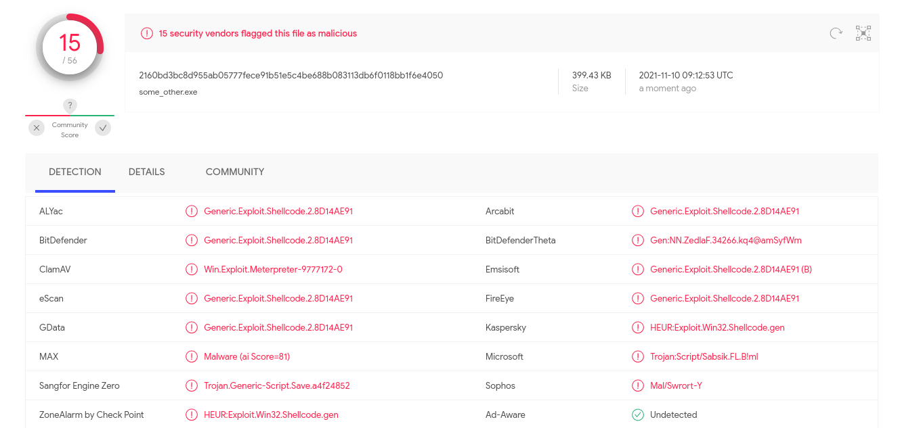
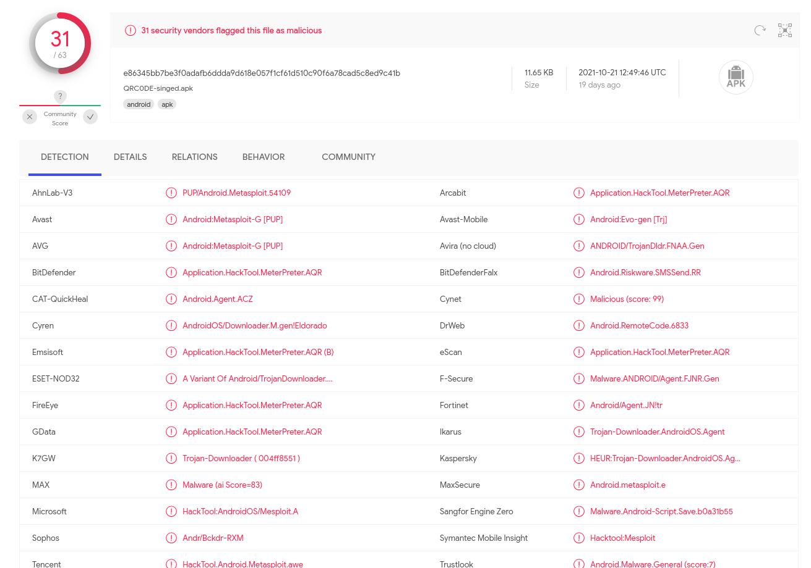

# Ataskaitą pildė:

- Gediminas Jakutis, Kauno Technologijos Universitetas
- Paulius Ratkevičius, Kauno Technologijos Universitetas

# Klausimai

## SL2

1. Kas ir kada atsitiko prijungus laikmeną?

- `2021-10-18T10:42:59+0000`

```
1448    1924    cmd.exe 0xc104b52b7080  5       -       2       True    2021-08-31 10:26:01.000000      N/A     Disabled
184     1448    cmd.exe 0xc104b4cb6080  0       -       2       True    2021-08-31 10:34:47.000000      2021-10-18 10:37:32.000000      Disabled
4508    1924    cmd.exe 0xc104b5104080  8       -       2       False   2021-10-18 10:45:39.000000      N/A     Disabled
```

- panašu pasileido PID 4508

  ###### nustatyta naudojant: `volatility3`, `grep`

2. Kada ir ar tikrai piktavalis prisijungė, po to kai buvo prijungta USB
   laikmena?

- Taip, tarp `2021-10-18T13:21:12` ir `2021-10-18T13:43:16`

```
2021-10-18 13:21:12.041     1.442 TCP      83.171.40.125:1337  ->    158.129.5.145:51008       46   405409     1
2021-10-18 13:21:12.040     4.043 TCP      158.129.5.145:51008 ->    83.171.40.125:1337        53     7671     1
2021-10-18 13:22:28.325     1.516 TCP      83.171.40.125:1337  ->    158.129.5.145:51010       44   405291     1
2021-10-18 13:22:28.323     1.518 TCP      158.129.5.145:51010 ->    83.171.40.125:1337        52     7761     1
2021-10-18 13:22:48.046     3.734 TCP      158.129.5.145:51010 ->    83.171.40.125:1337         9     5094     1
2021-10-18 13:22:47.995     3.780 TCP      83.171.40.125:1337  ->    158.129.5.145:51010        6      754     1
2021-10-18 13:23:33.625     0.207 TCP      158.129.5.145:51010 ->    83.171.40.125:1337         3      322     1
2021-10-18 13:23:33.625     0.203 TCP      83.171.40.125:1337  ->    158.129.5.145:51010        5      520     1
2021-10-18 13:26:04.012     1.205 TCP      158.129.5.145:51019 ->    83.171.40.125:1337        46     7293     1
2021-10-18 13:26:04.014     1.207 TCP      83.171.40.125:1337  ->    158.129.5.145:51019       41   405117     1
2021-10-18 13:26:42.392    10.890 TCP      158.129.5.145:51019 ->    83.171.40.125:1337        19     8466     1
2021-10-18 13:26:42.343    10.939 TCP      83.171.40.125:1337  ->    158.129.5.145:51019       13     1772     1
2021-10-18 13:27:32.079     0.907 TCP      158.129.5.145:51019 ->    83.171.40.125:1337        10     2380     1
2021-10-18 13:27:32.032     0.999 TCP      83.171.40.125:1337  ->    158.129.5.145:51019        8     1078     1
2021-10-18 13:27:49.434     1.632 TCP      83.171.40.125:1337  ->    158.129.5.145:51019        9     1170     1
2021-10-18 13:27:49.486     1.580 TCP      158.129.5.145:51019 ->    83.171.40.125:1337        13     6798     1
2021-10-18 13:28:51.186     0.095 TCP      83.171.40.125:1337  ->    158.129.5.145:51019        2      246     1
2021-10-18 13:28:51.237     0.000 TCP      158.129.5.145:51019 ->    83.171.40.125:1337         1      214     1
2021-10-18 13:29:10.283     0.047 TCP      83.171.40.125:1337  ->    158.129.5.145:51019        2      230     1
2021-10-18 13:29:10.330     0.000 TCP      158.129.5.145:51019 ->    83.171.40.125:1337         2      524     1
2021-10-18 13:30:09.347     1.151 TCP      158.129.5.145:51019 ->    83.171.40.125:1337        13      862     1
2021-10-18 13:30:09.347     1.151 TCP      83.171.40.125:1337  ->    158.129.5.145:51019       18    79670     1
2021-10-18 13:30:27.739     0.064 TCP      83.171.40.125:1337  ->    158.129.5.145:51019        2      230     1
2021-10-18 13:30:27.784     0.015 TCP      158.129.5.145:51019 ->    83.171.40.125:1337         2      252     1
2021-10-18 13:30:40.362     0.142 TCP      158.129.5.145:51019 ->    83.171.40.125:1337         9     6262     1
2021-10-18 13:30:40.317     0.187 TCP      83.171.40.125:1337  ->    158.129.5.145:51019        5      694     1
2021-10-18 13:31:40.621     0.099 TCP      83.171.40.125:1337  ->    158.129.5.145:51019        2      246     1
2021-10-18 13:31:40.675     0.000 TCP      158.129.5.145:51019 ->    83.171.40.125:1337         2      268     1
2021-10-18 13:32:40.788     0.061 TCP      83.171.40.125:1337  ->    158.129.5.145:51019        2      246     1
2021-10-18 13:32:40.832     0.013 TCP      158.129.5.145:51019 ->    83.171.40.125:1337         2      268     1
2021-10-18 13:33:40.966     0.056 TCP      83.171.40.125:1337  ->    158.129.5.145:51019        2      246     1
2021-10-18 13:33:41.020     0.002 TCP      158.129.5.145:51019 ->    83.171.40.125:1337         2      268     1
2021-10-18 13:34:31.877     0.847 TCP      83.171.40.125:1337  ->    158.129.5.145:51019       21   202822     1
2021-10-18 13:34:31.927     0.797 TCP      158.129.5.145:51019 ->    83.171.40.125:1337        21     1534     1
2021-10-18 13:34:47.349     9.734 TCP      158.129.5.145:51019 ->    83.171.40.125:1337        16     3936     1
2021-10-18 13:34:47.307     9.780 TCP      83.171.40.125:1337  ->    158.129.5.145:51019       15     1736     1
2021-10-18 13:35:57.240     0.015 TCP      158.129.5.145:51019 ->    83.171.40.125:1337         2      268     1
2021-10-18 13:35:57.195     0.063 TCP      83.171.40.125:1337  ->    158.129.5.145:51019        2      246     1
2021-10-18 13:36:04.914     5.231 TCP      158.129.5.145:51019 ->    83.171.40.125:1337         7     2314     1
2021-10-18 13:36:04.855     5.290 TCP      83.171.40.125:1337  ->    158.129.5.145:51019        7      752     1
2021-10-18 13:37:10.302     0.014 TCP      158.129.5.145:51019 ->    83.171.40.125:1337         2      268     1
2021-10-18 13:37:10.260     0.057 TCP      83.171.40.125:1337  ->    158.129.5.145:51019        2      246     1
2021-10-18 13:37:41.959     0.210 TCP      158.129.5.145:51019 ->    83.171.40.125:1337         2      108     1
2021-10-18 13:37:42.004     0.169 TCP      83.171.40.125:1337  ->    158.129.5.145:51019        3      290     1
2021-10-18 13:38:44.278     1.213 TCP      158.129.5.145:51190 ->    83.171.40.125:1337        46     7293     1
2021-10-18 13:38:44.280     1.215 TCP      83.171.40.125:1337  ->    158.129.5.145:51190       42   405175     1
2021-10-18 13:39:04.553     0.049 TCP      158.129.5.145:51190 ->    83.171.40.125:1337         3      338     1
2021-10-18 13:39:04.504     0.056 TCP      83.171.40.125:1337  ->    158.129.5.145:51190        3      432     1
2021-10-18 13:39:04.727     0.000 TCP      158.129.5.145:51190 ->    83.171.40.125:1337         2      332     1
2021-10-18 13:39:04.683     0.000 TCP      83.171.40.125:1337  ->    158.129.5.145:51190        1      202     1
2021-10-18 13:39:08.429     0.000 TCP      158.129.5.145:51190 ->    83.171.40.125:1337         4     4424     1
2021-10-18 13:39:08.429     0.000 TCP      83.171.40.125:1337  ->    158.129.5.145:51190        1       60     1
2021-10-18 13:39:16.257     3.422 TCP      158.129.5.145:51190 ->    83.171.40.125:1337         8     1040     1
2021-10-18 13:39:16.136     3.587 TCP      83.171.40.125:1337  ->    158.129.5.145:51190        7      892     1
2021-10-18 13:39:20.848    20.098 TCP      158.129.5.145:51190 ->    83.171.40.125:1337        22     9108     1
2021-10-18 13:39:20.664    20.331 TCP      83.171.40.125:1337  ->    158.129.5.145:51190       16     2078     1
2021-10-18 13:39:55.492     8.907 TCP      158.129.5.145:51190 ->    83.171.40.125:1337        14     3492     1
2021-10-18 13:39:55.445     8.954 TCP      83.171.40.125:1337  ->    158.129.5.145:51190       13     1522     1
2021-10-18 13:40:45.852     4.187 TCP      158.129.5.145:51190 ->    83.171.40.125:1337         7     2362     1
2021-10-18 13:40:45.805     4.238 TCP      83.171.40.125:1337  ->    158.129.5.145:51190        7      752     1
2021-10-18 13:41:21.227     0.064 TCP      158.129.5.145:51190 ->    83.171.40.125:1337         4      712     1
2021-10-18 13:41:21.179     0.112 TCP      83.171.40.125:1337  ->    158.129.5.145:51190        4      382     1
2021-10-18 13:41:32.555     0.562 TCP      158.129.5.145:51190 ->    83.171.40.125:1337       483   643362     1
2021-10-18 13:41:32.501     0.660 TCP      83.171.40.125:1337  ->    158.129.5.145:51190       33     2926     1
2021-10-18 13:41:43.602     0.392 TCP      158.129.5.145:51190 ->    83.171.40.125:1337        29    23886     1
2021-10-18 13:41:43.552     0.486 TCP      83.171.40.125:1337  ->    158.129.5.145:51190       11     1606     1
2021-10-18 13:42:22.711     0.129 TCP      158.129.5.145:51190 ->    83.171.40.125:1337        10     6636     1
2021-10-18 13:42:22.655     0.185 TCP      83.171.40.125:1337  ->    158.129.5.145:51190        6      754     1
2021-10-18 13:42:37.775     5.984 TCP      158.129.5.145:51190 ->    83.171.40.125:1337        12     6888     1
2021-10-18 13:42:37.724     6.035 TCP      83.171.40.125:1337  ->    158.129.5.145:51190        8      984     1
2021-10-18 13:43:16.415     0.207 TCP      158.129.5.145:51190 ->    83.171.40.125:1337         3      322     1
2021-10-18 13:43:16.414     0.209 TCP      83.171.40.125:1337  ->    158.129.5.145:51190        4      460     1
```

  ###### nustatyta naudojant: `grep` netflow duomenis

3. Kada šie veiksmai buvo atlikti?

- Tarp `2021-10-18T13:21:12` ir `2021-10-18T13:43:16`

  ###### nustatyta pagal 2 punktą

4. Kokius tolimesnius veiksmus ir kada atliko piktavalis?

- sukelti PE su shellcode, sha256sum:

  - `a7121b8eca5bd7d1b21a919a954fa7d772148690ca2e267767117aec00a0f1ad`
  - `2160bd3bc8d955ab05777fece91b51e5c4be688b083113db6f0118bb1f6e4050`

- analizavus su virustotal rodo: 
  

  ###### nustatyta iš [nešifruoto] tcp dump'o iš pcap

5. Kokia informacija buvo nutekinta?

- Documents.zip

```
Archive:  Documents.zip
 Length   Method    Size  Cmpr    Date    Time   CRC-32   Name
--------  ------  ------- ---- ---------- ----- --------  ----
   13976  Defl:N    11026  21% 05-23-2021 22:57 4b6b364c  Documents\atostogu grafikas.xlsx
   12677  Defl:N     9707  23% 05-27-2021 00:57 b097da89  Documents\covid-19 suvestine.xlsx
--------          -------  ---                            -------
   26653            20733  22%                            2 files

```

- Desktop.zip

```
Archive:  Desktop.zip
 Length   Method    Size  Cmpr    Date    Time   CRC-32   Name
--------  ------  ------- ---- ---------- ----- --------  ----
  353915  Defl:N   342991   3% 05-19-2021 22:02 544bf431  Desktop\Babinos remontas - isankstine saskaita.pdf
  273936  Defl:N   272689   1% 05-19-2021 20:28 45f7f7e2  Desktop\pakvietimas.png
--------          -------  ---                            -------
  627851           615680   2%                            2 files

```

- `atostogu grafikas.xlsx`
  - Darbuotojų vardai ir pavardės
  - Darbuotojų pareigos
  - Atostogų grafikai
- `covid-19 suvestine.xlsxi`
  - Darbuotojų vardai ir pavardės
  - Darbuotojų pareigos
  - Darbuotojų gimimo datos
  - COVID-19 vakcinacijos statusas
- `pakvietimas.png`
  - Žmogaus vardu Palemonas telefono numeris
  - Palemono sūnaus vardu Erazmas gimimo data
- `Babinos remontas - isankstine saskaita.pdf`
  - Remonto kaštai
  - Užsakovo vardas ir pavarde, telefono numeris

## SL5

1. Kaip buvo užvaldyta svetainė?

- `HTTP POST` užklausa įkeltas `index2.php` failas veikiantis kaip reverse shell
  ir `exploit.sh` gauti `root` teisėms.

  ###### nustatyta iš [nešifruotos] HTTP užklausos užfiksuotos sraute

2. Kada tai atlikta?

- tarp `2021-10-18T15:00:10Z` ir `2021-10-18T15:08:20Z`

  - čia laikai duoti UTC, o log failuose yra -04:00, laiko zona EDT

  ###### nustatyta pritaikius `grep` apache `access.log`

3. Koks TVS įskiepis buvo pažeidžiamas?

- `cysteme-finder` (wordpress)

  ###### nustatyta iš [nešifruotos] HTTP užklausos užfiksuotos sraute – užklausa nurodo įskiepio vardą

4. Kokia kenksminga užklausa buvo atsiųsta.

- `POST /wp-content/plugins/cysteme-finder/php/connector.php?wphome=/var/www/html/&wpurl=http://158.129.5.146 HTTP/1.1`

  ###### nustatyta iš [nešifruotos] HTTP užklausos užfiksuotos sraute

5. Kada ji buvo atsiųsta?

- `2021-10-18T15:00:10Z`

  - čia laikai duoti UTC, o log failuose yra -04:00, laiko zona EDT

  ###### nustatyta pagal netflow koreliuoto su užklausa iš punkto 4

6. Iš kokio IP adreso tai buvo padaryta?

- `83.171.40.125`

  ###### nustatyta pagal užklausos srcaddr užfiksuotos sraute ir patikrinus apache `access.log`

7. Koks buvo jos tikslas?

- įkelti reverse-shell failą index2.php

  ###### nustatyta padarius užklausos HTTP dump ir pasižiūrėjus į failą

8. Koks CVE buvo išnaudotas?

- CVE-2016-10955

  ###### nustatyta su web paieškos užklausa `cisteme-finder POST vulnerability CVE` ir suradus variantą, kuris atitiko ataką

9. Kokius veiksmus atliko piktavalis

- atspėjo vartotojo `user` slaptažodį (brutefoce silpną slaptažodį?) per `ssh`
  - `Oct 18 11:22:43 www1 sshd[1621]: Accepted password for user from 83.171.40.125 port 37272 ssh2`
- pasidarė `root` teises ir prisijungė kaip `root`

```
Oct 18 11:23:38 www1 sshd[1641]: Accepted password for user from 83.171.40.125 port 37274 ssh2
Oct 18 11:23:38 www1 sshd[1641]: pam_unix(sshd:session): session opened for user user by (uid=0)
Oct 18 11:23:38 www1 systemd-logind[359]: New session 8 of user user.
Oct 18 11:23:38 www1 systemd: pam_unix(systemd-user:session): session opened for user user by (uid=0)
Oct 18 11:23:57 www1 su: (to root) user on pts/0
Oct 18 11:23:57 www1 su: pam_unix(su:session): session opened for user root by user(uid=0)
Oct 18 11:24:27 www1 su: pam_unix(su:session): session closed for user root
Oct 18 11:24:27 www1 su: (to root) user on pts/0
Oct 18 11:24:27 www1 su: pam_unix(su:session): session opened for user root by user(uid=0)
Oct 18 11:24:29 www1 su: pam_unix(su:session): session closed for user root
```

  ###### nustatyta su `grep` analizuojat `/var/log/auth.log`

- pasižiūrėjo `/backup` direktorijos turinį per reverse shell ir nutekino keletą
  failų.

  ###### nustatyta peržiūrėjus visas HTTPS užklausas iš atakuojančiojo ip adreso sraute

10. Kada šie veiksmai buvo atlikti?

- direktorijos turinys paimtas `2021-10-18T15:04:58Z`
- ssh laužimas root teisių paėmimas vyko tarp `2021-10-18T15:13:19` ir
  `2021-10-18T15:24:29`

  - čia laikai duoti UTC, o log failuose yra -04:00, laiko zona EDT

  ###### nustatyta pagal `/var/log/auth.log` ir `/var/log/apache2/access.log`

11. Iš kokio IP adreso tai buvo atlikta?

- `83.171.40.125`

  ###### nustatyta pagal HTTPS užklausų srcaddr

12. Kokie failai buvo parsisiųsti / nutekinti?

- `/backup/asmenu_duomenys_is_DB.csv`
- `/backup/asmenu_duomenys_is_DB.xlsx`
- `/backup/wp_ks2021.sql`
- `/etc/passwd`

  ###### nustatyta peržiūrėjus visas HTTPS užklausas iš atakuojančiojo ip adreso sraute ir išsaugojus perduotų duomenų turinį

13. Iš kurio katalogo parsisiuntė failus?

- `/backup`
- `/etc`

  ###### nustatyta pagal užklausų eilutes

14. Kada parsisiuntė failus?

- tarp `2021-10-18T15:07:38Z` ir `2021-10-18T15:18:32`

  - čia laikai duoti UTC, o log failuose yra -04:00, laiko zona EDT

  ###### nustatyta pagal `/var/log/apache2/access.log`

15. Kas parsisiuntė failus?

- stoties adresu `83.171.40.125` galinis naudotojas (darant prielaidą tai
  zombie)

  ###### nustatyta pagal HTTPS užklausų srcaddr

16. kokia jautri informacija buvo saugoma `wp_ks2021.sql`

- Nutekinta TVS administratoriaus slaptažodžio hash

```
INSERT INTO `wp_users` VALUES (1,'admin','$P$B3oEaW8iUNesGgQWw68DES/43eWLtq0','admin','admin@www1.organizacija.ks2021.lt','http://158.129.5.146','2021-06-15 07:57:06','',0,'admin');
```

  ###### nustatyta iš failo turinio

17. Kaip dar įsilaužėlis pateko į virtualų privatų serverį.

- į patį serverį prisijungė su `ssh`

  ###### nustatyta iš failo `/var/log/auth.log`

18. Kada prasidėjo ataka?

- ssh laužimas root teisių paėmimas vyko tarp `2021-10-18T15:13:19` ir
  `2021-10-18T15:24:29`

  - čia laikai duoti UTC, o log failuose yra -04:00, laiko zona EDT

  ###### nustatyta pagal `/var/log/auth.log`

19. Kada įsilaužėlis pateko į virtualų privatų serverį?

- sėkmingas ssh prisijungimas įvyko `2021-10-18T15:23:38Z`

  - čia laikai duoti UTC, o log failuose yra -04:00, laiko zona EDT

  ###### nustatyta pagal `/var/log/auth.log`

20. Kaip piktavalis gavo naudotojų sąrašą?

- iš `/etc/passwd` failo

21. Kaip piktavalis gavo sudo/root teises?

- paleisdamas `exploit.sh`, kuris išnaudoja CVE-2010-0426

22. Kada piktavalis gavo root?

- pirmas sėmingas autorizavimasis kaip `root` įvyko `2021-10-18T15:23:57Z`

  - čia laikai duoti UTC, o log failuose yra -04:00, laiko zona EDT

  ###### nustatyta pagal `/var/log/auth.log`

23. Per kokį vartotoją gavo root teises?

- per vartotoją `user`

  ###### nustatyta pagal `/var/log/auth.log`

24. Kur randasi sudo “exploit” failiukas?

- `/var/www/html/exploit.sh`

  ###### nustatyta su `find / -iname exploit.sh`

25. Koks sudo exploit failo pavadinimas?

- `exploit.sh`

  ###### nustatyta pagal HTTP užklausą

26. Kaip piktavalis žinojo kokie failai yra “backup” direktorijoje.

- su HTTP GET užklasa
  `GET /wp-content/plugins/cysteme-finder/php/connector.php?wphome=/backup&cmd=open&init=1&tree=1`
  gavo direktorijos turinį json pavidalu

## SL6

1. Ar galite nustatyti kokiu mobiliuoju telefonu darbuotojas naudojosi?

- Samsung Galaxy S6 Edge

	###### nustatyta pagal `f-droid` programėlės `localRepoName` iš `org.fdroid.fdroid_preferences.xml` failo

2. Ar galite paaiškinti QR kodo paskirtį?

- QR kodas laiko nuorodą į kenkėjišą programėlę (APK) su URL `http://83.171.40.125/QRC0DE-singed.apk`

3. Ar galite nustatyti kokia kenkėjiška programinė įranga buvo sudiegta į

   mobilųjį telefoną? QRC0DE-singed.apk 

4. Ar galite paaiškinti kam konkrečiai yra skirta QRC0DE programinė įranga ir
   kokius veiksmus jos pagalbą galėjo atlikti piktavalis?

5. Kokius failus galėjo paimti piktavalis?

6. Kokiu įrenginiu ir kada buvo fotografuojamas duomenį centras?

7. Ar galite pasakyti kur yra duomenų centras?

- 1360 Kifer Rd, Sunnyvale, CA 94086, USA

  ###### nustatyta iš kooridinačių rastų duomenų centro nuotraukos metaduomenyse
